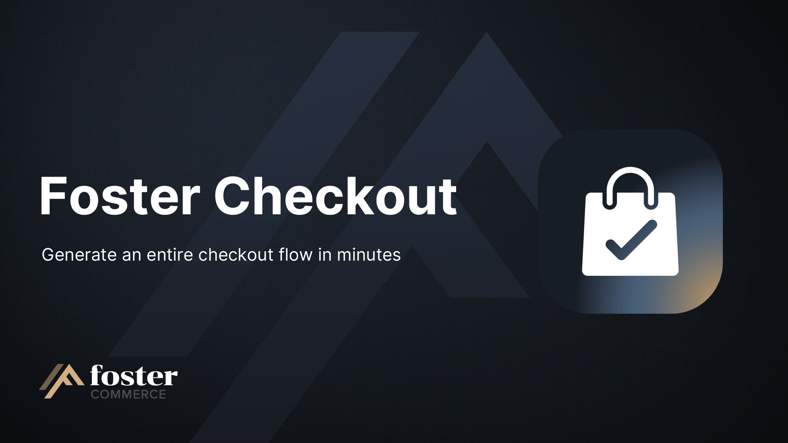

# Foster Checkout

A drop-in **checkout** for Craft Commerce, with its copy and settings managed from the control panel.

## Overview

- Ships a complete cart and checkout flow (email, address, shipping, billing, payment, confirmation) at paths you choose.
- Lets store admins edit checkout copy on production, with no custom fields to create and map, and no developer involvement.
- Keeps copy per site or per language on multi-site installs, so each storefront reads its own wording.
- Puts branding, feature switches, line item display, product image fields, payment gateway fields and paths on control panel screens, so a store can run without a config file.
- Accepts a `foster-checkout.php` config file for developer-managed sites, which overrides the control panel one setting at a time.
- Adds extra fields to a payment method (an account number, for example) and shows a note when a customer selects it.

## Requirements

- Craft CMS `^5.0.0`
- Craft Commerce `^5.0.15`
- PHP `^8.3`

## Install

```sh
composer require fostercommerce/craft-foster-checkout
./craft plugin/install foster-checkout
```

See [`docs/installation.md`](./docs/installation.md) for the full guide.

## Content

The plugin stores checkout copy in its own database table rather than project config, so it stays editable on production where admin changes are disabled. Admins edit it at **Checkout -> Content**: notes for each step, payment method notes, and the footer links shown across the cart and checkout.

Each note is rendered as a Twig template, so copy can reference the cart or the order. On a multi-site install, copy varies per site or per language depending on the content translation method.

See [`docs/user-guide/content.md`](./docs/user-guide/content.md).

## Settings

Appearance, features, line items, products, payment gateways and paths each get a control panel screen under **Checkout**. Anything a site sets in `config/foster-checkout.php` wins over the control panel, per key, and those fields are shown as read-only so it is clear why an edit will not take.

See [`docs/reference/settings.md`](./docs/reference/settings.md).

## Line items

Rules rewrite what a cart line shows for an option a customer chose, so a stored `blessing: true` reads as `Blessing Services: Yes`. Each rule pairs a condition on the option's name or value with a replacement name, a replacement value, or both.

Values are left alone unless a rule sets one, which keeps free text as the customer typed it. Long values can be truncated, and the SKU can be hidden.

See [`docs/user-guide/line-items.md`](./docs/user-guide/line-items.md).

## Checkout fields

Ask a customer for anything the checkout does not collect. Five positions across the checkout each hold a field layout, and a field added to one is shown at that point. Fields have to exist on the order first, and a required field on the summary blocks the cart rather than payment.

See [`docs/user-guide/checkout-fields.md`](./docs/user-guide/checkout-fields.md).

## Single-page checkout

Run the checkout as one page instead of separate steps. The cart saves as the customer types, and every other setting applies to both layouts, so a store can switch without reconfiguring anything.

See [`docs/user-guide/single-page-checkout.md`](./docs/user-guide/single-page-checkout.md).

## Address verification and suggestions

Catch a bad shipping address before it reaches fulfillment. Avalara returns a corrected address the customer can accept, or Google Places and Loqate suggest addresses as they type. Both need their own account and key.

See [`docs/reference/settings.md`](./docs/reference/settings.md).

## Custom includes

Two of your own templates can be injected into every cart and checkout page, one into the head and one before the closing body tag, for analytics, tracking pixels or support widgets. Each receives the current context, step and cart, so a single template can target one step or run across all of them.

See [`docs/dev-guide/custom-includes.md`](./docs/dev-guide/custom-includes.md).

## Permissions

- `foster-checkout-viewContent`: view the Content screen.
- `foster-checkout-editContent`: edit checkout copy. Copy is rendered as Twig, so this grants server-side code execution.
- `foster-checkout-manageAppearance`: edit branding.
- `foster-checkout-manageFeatures`: edit feature switches.
- `foster-checkout-manageSettings`: edit products, payment gateways and general settings.

Craft's own `accessPlugin-foster-checkout` is required in addition to any of the above.

See [`docs/reference/permissions.md`](./docs/reference/permissions.md).

## License

Proprietary.

## Documentation

See [`docs/index.md`](./docs/index.md).

## Credits

Brought to you by [Foster Commerce](https://fostercommerce.com).
